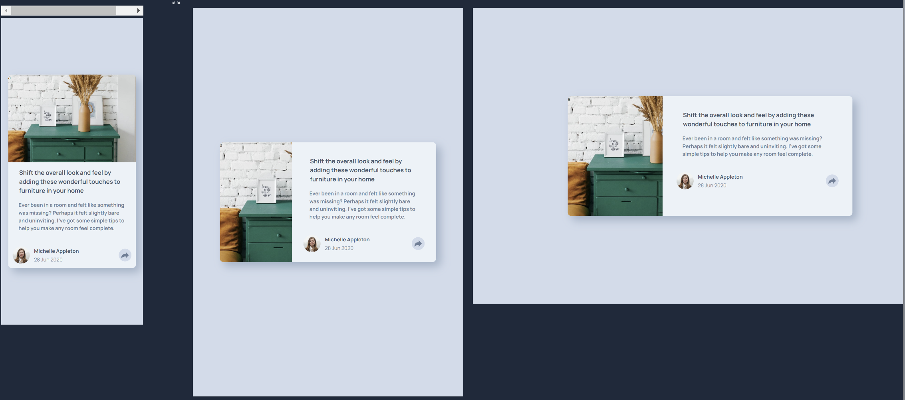

# Frontend Mentor - Article preview component solution

This is a solution to the [Article preview component challenge on Frontend Mentor](https://www.frontendmentor.io/challenges/article-preview-component-dYBN_pYFT). Frontend Mentor challenges help you improve your coding skills by building realistic projects.

## Table of contents

- [Overview](#overview)
  - [The challenge](#the-challenge)
  - [Screenshot](#screenshot)
  - [Links](#links)
- [My process](#my-process)
  - [Built with](#built-with)
  - [What I learned](#what-i-learned)
  - [Continued development](#continued-development)
- [Author](#author)

## Overview

### The challenge

Users should be able to:

- View the optimal layout for the component depending on their device's screen size
- See the social media share links when they click the share icon

### Screenshot

- Solution



- Solution Active

;
const cardProfileContainer = document.getElementById("cardProfileContainer");
const originalContent = document.getElementById("cardProfileInfo");
const cardProfileInfoActive = document.getElementById("cardProfileInfoActive");
const nonMobileProfileActive = document.getElementById(
  "share-active-icons-non-mob"
);
let isActive = false;

shareIcon.addEventListener("click", () => {
  isActive = !isActive;

  if (window.matchMedia("(min-width: 48em)").matches) {
    // Tablet or larger view
    nonMobileProfileActive.style.display = isActive ? "block" : "none";
  } else {
    // Mobile View
    if (isActive) {
      originalContent.style.display = "none";
      cardProfileInfoActive.style.display = "flex";
      cardProfileContainer.style.backgroundColor = "hsl(217, 19%, 35%)";
    } else {
      originalContent.style.display = "flex";
      cardProfileInfoActive.style.display = "none";
      cardProfileContainer.style.backgroundColor = "hsl(210, 46%, 95%)";
    }
  }
});

```

### Continued development

Add a smoother transition between the toggle state.

## Author

- Frontend Mentor - https://www.frontendmentor.io/profile/jonmc89
